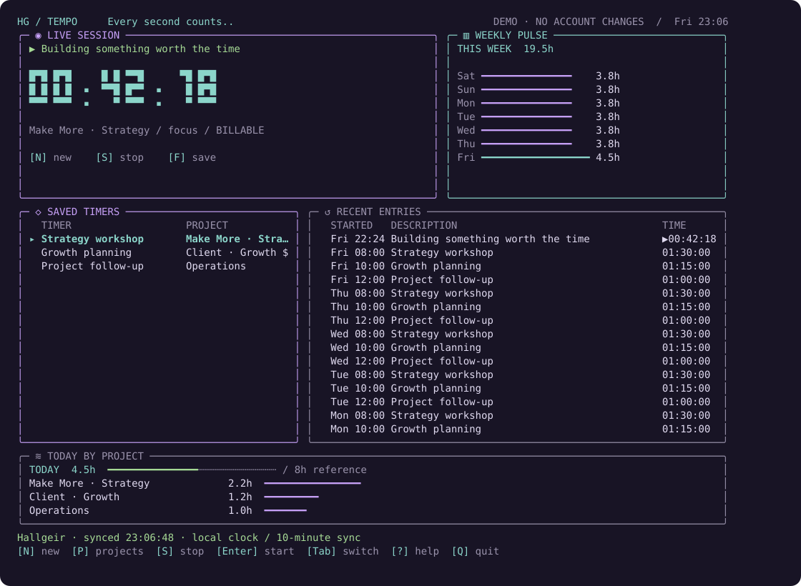

# Tempo — Toggl for Omarchy

A keyboard-first Toggl Track dashboard written in **Go**, with a **btop-inspired terminal interface** and a live Omarchy bar timer.

Start work, repeat recent entries, and keep saved timers a keystroke away. See today's project totals and your week's activity without opening a browser.



> **Preview release:** usable baseline, still under design review. HG styling, full Omarchy theme integration, and user customization are planned before any catalog submission. The current terminal palette is fixed; full theme support is not yet implemented.

## What you get

- Live timer in the Omarchy bar; click it to open or focus the dashboard.
- Start/stop timers, repeat recent entries, and create/edit reusable saved timers.
- Workspace, project, tags, and billable controls when creating a timer.
- Daily project totals, seven-day activity, and calendar-week totals.
- CSV export of cached entries.
- Shared local cache, private token storage, and a demo mode that never changes Toggl.

Tempo is an independent project inspired by Timery and btop. It is not affiliated with Timery, Toggl, or btop. Saved timers are local to Tempo; Timery/iCloud saved timers are not imported.

## Install

Requires an Omarchy installation with `omarchy-shell` plugin support and a working terminal launcher. The bundled binary targets **Linux x86-64**; Go is only needed to rebuild it. Other architectures must build from source.

```bash
omarchy plugin add https://github.com/hallgeirg/omarchy-tempo.git --enable
```

Click **Tempo** in the top bar. Or launch it directly:

```bash
~/.config/omarchy/plugins/hallgeirg.timery/bin/tempo-window
```

The plugin ID remains `hallgeirg.timery`. If you already have an earlier local copy with that ID, back it up and move it out of the plugins directory before installing; Omarchy rejects duplicate IDs. Your credentials and saved timers live separately and are not part of the plugin checkout.

## Connect Toggl

1. Open your [Toggl profile](https://track.toggl.com/profile) and find your API token.
2. Open Tempo and press **A**.
3. Paste the token into the masked field and confirm.
4. Press **N** to create a timer, select its workspace/project, and confirm.

Enter your token inside Tempo, never in a GitHub issue or shell command. Starting a timer first stops the timer currently running in Toggl, including one started on another device. **Q** closes the dashboard while the timer keeps running.

## Keyboard controls

| Key | Action |
| --- | --- |
| **N** | New timer |
| **S** | Stop current Toggl timer |
| **Enter** | Start selected saved timer or repeat recent entry |
| **F** | Save selected/current entry as a reusable timer |
| **E** | Edit selected saved timer |
| **Delete** | Delete selected local saved timer |
| **Tab / Left / Right** | Switch tables; select options in forms |
| **Up / Down / J / K** | Select an entry |
| **R** | Refresh Toggl data |
| **A** | Connect or change account |
| **X** | Export CSV |
| **Q** | Quit dashboard |

In a form, **Tab** moves between fields, **Left/Right** changes options, and **Enter** moves to Confirm; press Enter again to submit. **Esc** cancels.

## Preview without an account

```bash
~/.config/omarchy/plugins/hallgeirg.timery/bin/tempo --demo
```

The demo uses fictional entries and makes no account changes. Use a terminal of at least **72 columns × 26 rows**; around 120 × 42 works well. [Window sizing and troubleshooting](docs/troubleshooting.md).

## Privacy and limitations

The API token is stored locally in `~/.config/omarchy-tempo/credentials.json` with mode `0600`. It is a plaintext credential protected by filesystem permissions, not an encrypted vault. The token is excluded from snapshots, logs, and process arguments. Requests use HTTPS to Toggl's API.

The dashboard and bar share a cache. Normal full sync uses two API reads every ten minutes, with a fifteen-minute backoff after a failed sync. Manual refreshes and timer actions also use requests. Clocks tick locally between syncs; changes from another device may take until the next sync to appear.

Reports cover entries starting within the last fourteen days. Midnight-spanning sessions split at local day boundaries. Calendar-week totals and the eight-hour progress reference are informational, not billing reports. Historical entry editing, manual time entry, and Timery/iCloud import are not implemented in v0.1.0. No historical entry deletion endpoint is exposed.

[Detailed usage](docs/usage.md) · [Troubleshooting](docs/troubleshooting.md) · [Development](CONTRIBUTING.md) · [Security](SECURITY.md)

## Build from source

Install the Go version specified in `src/go.mod`, then:

```bash
make build
make test
```

The app uses [Bubble Tea](https://github.com/charmbracelet/bubbletea) and [Lip Gloss](https://github.com/charmbracelet/lipgloss). Dependencies are pinned in `src/go.mod` and `src/go.sum`.

## License

[MIT](LICENSE). See [third-party notices](THIRD_PARTY_NOTICES.md) for dependencies. Toggl integration uses the [official Track API](https://engineering.toggl.com/docs/track/api/).
